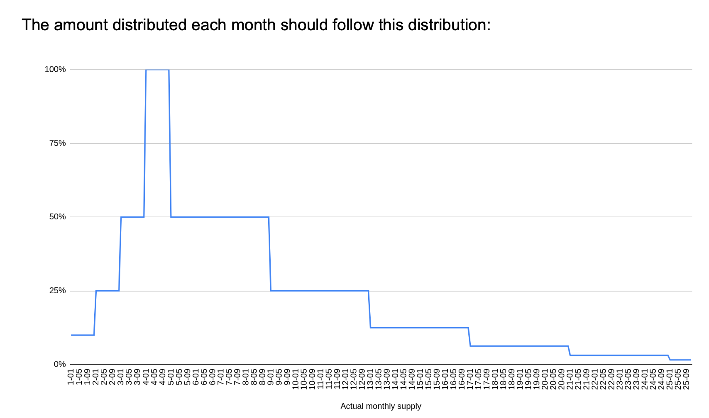
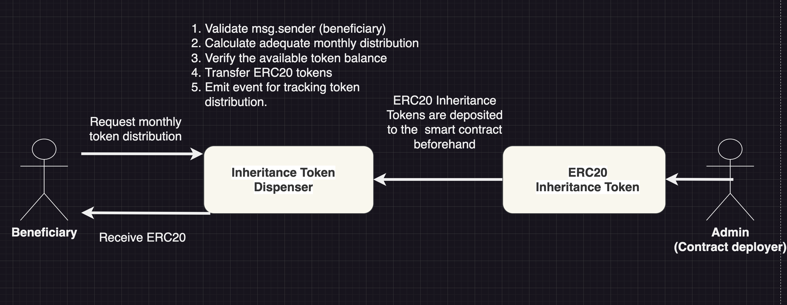
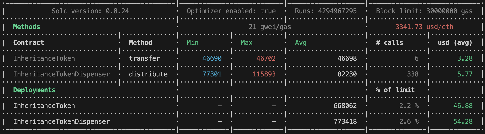
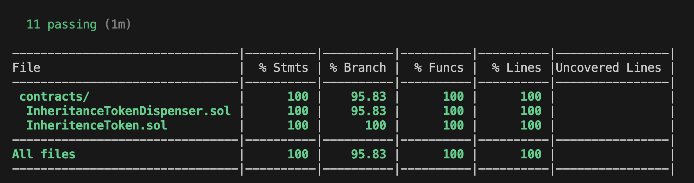
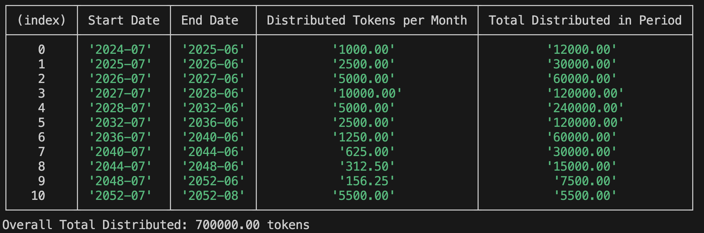

# ERC20 Token Dispenser

## Instructions // Goal

Design and code a smart contract (or set of smart contracts) that will distribute ERC20 tokens over time on a predetermined schedule.

The system must provide a mechanism to distribute the tokens `monthly`. This could be in one or many payments. What is important is that under no circumstances we distribute more than the specified amount in any month. Due to this restriction, if the receiver forgets to claim in some months, the system will only be able to pay what is available only in the current month.

### Distribution Schedule

The amount distributed each month should follow this distribution:

- **Maximum tokens to distribute any month:** 10,000
- **Year 1:** 10% of the max
- **Year 2:** 25% of the max
- **Year 3:** 50% of the max
- **Year 4:** 100% of the max
- **Year 8:** 50% of the max
- **Year 12:** 25% of the max
- **Year ...:** half of the previous period

*NOTE:* This should be stopped when the monthly distribution reaches 100 tokens or less, in which case we should distribute all the remaining tokens or provide a mechanism to ensure there are no tokens left. The total amount of tokens to distribute is 700,000.

Tokens just need to be used by one specific address which could be hardcoded in the contract or set by the owner.

## Use Case Example (Trust Fund Inheritance)

A real-life usecase for this functionality could be a `trust-fund` implementation. 

*EXAMPLE:* Grandfather leaves an inheritance to his grandson (contract `beneficiary`) but wants to ensure the inheritance is spent responsibly over time. The smart contract enforces monthly distribution limits, preventing the grandson from spending all the funds at once, thus ensuring stable financial support over a longer period.

### Additional Considerations

- The system should not require off-chain components (bots, API servers).
- The requirements are somewhat flexible: recommended changes that greatly simplify the system or lower GAS costs will be considered. Please ask over email first.

# Deliverables Requested

1. High-level system architecture spec (text or diagram).
2. Smart-contract(s) on a GitHub repository.
3. Address(es) of the smart contract(s) deployed on the Goerli testnet.

*NOTE:* (Decided to deploy on `Sepolia` as `Goerli` testnet has been deprecated)

## Deployed Contract Information

- Token Dispenser: [0x1D75cE92CDb9De7a8e21576E4a9dD91E6a01C87b](https://sepolia.etherscan.io/address/0x1D75cE92CDb9De7a8e21576E4a9dD91E6a01C87b#code)
- ERC20 InheritanceToken Address: [0xbB49B419eEA95EAe6efA1289Bb211bD73A1222dE](https://sepolia.etherscan.io/address/0xbB49B419eEA95EAe6efA1289Bb211bD73A1222dE#code)
- Beneficiary Address: `0x01462340B3C8b18A9f2e73634AD4443E9C0A62cB`
- Beneficiary PrivateKey: `0xd64a00232df6683036e8e09ee0266dd2b7a4f82ea4673396ecc3c7cba582ac9f`
- First distribution: [View Transaction](https://sepolia.etherscan.io/tx/0x4f0edde8f0ec1a679823181890a4d559a0ea296768b6fc321b04a72546b247c4)

## Guide

- Clone the repository, go to the `.envExample` file, copy it and name it `.env`, then fill in all variables.
- Make sure that after cloning the repository you run `npm install`.
- The tests can be run with `npx hardhat test --network hardhat`.
- To verify SmartContract test coverage run `npx hardhat coverage`.

## High-level System Architecture Spec

## Gas Costs

## Test Coverage

## Token Distribution Summary (Tested)
This represents what the token distribution history would look like if the user claimed their allocated share every month. However, the logic of the smart contract accounts for scenarios where the contract beneficiary forgets to claim tokens for a given period.

